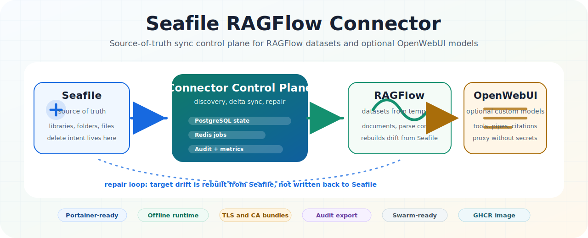

<p align="center">
  
</p>

<h1 align="center">Seafile RAGFlow Connector</h1>

<p align="center">
  Offline-fähiger Sync-Orchestrator für bestehende Seafile-, RAGFlow- und optionale OpenWebUI-Umgebungen.
</p>

<p align="center">
  <a href="https://github.com/adrianweidig/seafile-ragflow-connector/actions/workflows/test.yml"></a>
  <a href="https://github.com/adrianweidig/seafile-ragflow-connector/actions/workflows/docker.yml"></a>
  <a href="https://github.com/adrianweidig/seafile-ragflow-connector/actions/workflows/codeql.yml"></a>
  <a href="LICENSE"></a>
  <a href="pyproject.toml"></a>
  <a href="https://github.com/adrianweidig/seafile-ragflow-connector/issues"></a>
  <a href="https://github.com/adrianweidig/seafile-ragflow-connector/pulls"></a>
</p>

## Überblick

Der Seafile RAGFlow Connector betreibt eine eigene Control Plane zwischen einem
bestehenden Seafile-Server und einem bestehenden RAGFlow-Server. Seafile bleibt
die Quelle der Wahrheit. Der Connector entdeckt Libraries, erzeugt pro Library
ein RAGFlow-Dataset aus einem `connector_template`, importiert Dateien, erkennt
Änderungen, löscht entfernte Zielartefakte kontrolliert und repariert Drift aus
Seafile heraus.

Optional synchronisiert der Connector RAGFlow-Chats, OpenWebUI-Tools und
OpenWebUI-Pipes, damit RAGFlow-Datasets in OpenWebUI als Custom Models genutzt
werden können. Seafile, RAGFlow und OpenWebUI werden dabei nicht ersetzt,
sondern als externe Systeme angebunden.

## Quick Links

| Ziel | Einstieg |
| --- | --- |
| Schnellstart | [Docker Compose](#schnellstart-mit-docker-compose) oder [Portainer](#portainer-start) |
| Konfiguration | [`connector.env.example`](connector.env.example), [Environment-Referenz](docs/environment.md) |
| Betrieb | [Operations-Handbuch](docs/operations.md) |
| Architektur | [Architektur](docs/architecture.md) |
| TLS | [TLS-Topologie](docs/tls-topology.md), [TLS-Zertifikate](docs/tls-certificates.md), [Troubleshooting](docs/troubleshooting-ssl.md) |
| Entwicklung | [Entwicklungschecks](#entwicklung) und [Tests](docs/testing.md) |
| Mitarbeit | [CONTRIBUTING.md](CONTRIBUTING.md), [Security Policy](SECURITY.md), [Support](SUPPORT.md) |

## Kernprinzipien

- Die Seafile API ist die Quelle der Wahrheit.
- Die RAGFlow API und optional OpenWebUI sind Zielsysteme.
- Seafile wird nie geändert, nur weil Zielartefakte in RAGFlow oder OpenWebUI fehlen, gelöscht wurden oder driften.
- Entfernte Seafile-Dateien und -Libraries werden in den Zielsystemen nachvollzogen.
- Extern gelöschte RAGFlow- oder OpenWebUI-Artefakte werden aus Seafile und dem lokalen Connector-State repariert.
- PostgreSQL speichert den dauerhaften Sync-Zustand.
- Redis übernimmt Queueing, Retries und Backpressure.
- RAGFlow-Dataset-Einstellungen bleiben nach der Erstellung live. Das Template wird nur für neue Datasets genutzt.
- Der Runtime-Betrieb ist offline-fähig: keine Paket-Downloads, keine Telemetrie und keine externen Service-Abhängigkeiten außerhalb der konfigurierten Seafile-, RAGFlow- und optionalen OpenWebUI-URLs.

## Architektur

```text
Seafile API -> controller -> PostgreSQL state -> Redis jobs -> workers -> RAGFlow API
                         \-> reconciler ------------------------/
                         \-> OpenWebUI sync -> OpenWebUI API
                         \-> HTTP proxy ----> RAGFlow API
```

| Komponente | Aufgabe |
| --- | --- |
| `connector-controller` | Discovery-Loop, Dataset-Provisioning, Scheduling, Dashboard |
| `connector-worker` | Download, Klassifikation, Upload, Delete, Parse-Steuerung |
| `connector-reconciler` | Reparatur abweichender Zielzustände |
| PostgreSQL | dauerhafter Sync-, Job-, Dashboard- und Mapping-State |
| Redis | Queueing, Retries und Worker-Fan-out |
| OpenWebUI Sync | optionale Erzeugung von RAGFlow-Chats, Tools und Pipes |
| Connector Proxy | geschützte OpenWebUI-Abfragen ohne RAGFlow-Secrets im Function-Code |

Mehr Details stehen in [docs/architecture.md](docs/architecture.md).

## Features

- Seafile-Library-Discovery über Admin-API.
- RAGFlow-Dataset-Erzeugung aus einem vorhandenen Template-Dataset.
- Delta-Sync, Delete-Propagation und Drift-Reparatur.
- Textartefakt-Erzeugung für unterstützte und textbasierte Dateiformate.
- Wiederholbare Jobs mit Redis, PostgreSQL-State und konservativer Retry-Logik.
- Lesendes Dashboard mit Health, Sync-Historie, Logs, Diagnose und Excel-Audit-Export.
- Optionale OpenWebUI-Integration mit deterministischen Tools, Pipes und Custom-Model-Namen.
- TLS-/CA-Bundle-Konfiguration für Seafile, RAGFlow, OpenWebUI und Connector-Proxy.
- Portainer-, Docker-Compose- und Docker-Swarm-Artefakte.
- Lokales TLS-Lab und `.top.secret`-Compose-Runbook für Windows-/WSL-Prüfungen.
- CI für Linting, Typechecking und Tests sowie Docker-Image-Build/Publish nach GHCR.

## Voraussetzungen

- Docker mit Docker Compose Plugin oder Portainer für den regulären Betrieb.
- Ein erreichbarer Seafile-Server mit Admin-API-Token.
- Ein erreichbarer RAGFlow-Server mit API-Key.
- In RAGFlow existiert ein Template-Dataset, standardmäßig `connector_template`.
- Optional: eine erreichbare OpenWebUI-Instanz mit Admin-API-Key.
- Für lokale Entwicklung: Python `>=3.12` und `uv`.

## Schnellstart mit Docker Compose

Die einzige Betreiberkonfiguration ist [`connector.env.example`](connector.env.example).
Kopiere sie zu `connector.env`, setze die Pflichtwerte und validiere die
Compose-Konfiguration:

```bash
cp connector.env.example connector.env

docker compose \
  --env-file connector.env \
  -f deploy/portainer/docker-compose.yml \
  config --quiet
```

Minimalpflicht für Seafile -> RAGFlow mit Stack-Postgres:

| Variable | Zweck |
| --- | --- |
| `SEAFILE_BASE_URL` | aus dem Connector-Container erreichbare Seafile-URL |
| `SEAFILE_ADMIN_TOKEN` | Seafile Admin-API-Token für Library-Discovery |
| `SEAFILE_SYNC_USER_TOKEN` | Seafile API-Token für Datei-Downloads |
| `RAGFLOW_BASE_URL` | aus dem Connector-Container erreichbare RAGFlow-API-URL |
| `RAGFLOW_API_KEY` | API-Key des RAGFlow-Zielusers |
| `POSTGRES_PASSWORD` | Passwort für die Stack-Datenbank, sofern `DATABASE_URL` nicht gesetzt ist |

Start:

```bash
docker compose \
  --env-file connector.env \
  -f deploy/portainer/docker-compose.yml \
  up -d
```

Logs und Health:

```bash
docker compose \
  --env-file connector.env \
  -f deploy/portainer/docker-compose.yml \
  logs -f connector-controller connector-worker connector-reconciler

curl http://127.0.0.1:18080/api/health
```

Das Dashboard ist bei Default-Portbindung lokal unter `http://127.0.0.1:18080`
erreichbar, wenn `CONNECTOR_DASHBOARD_ENABLED=true` gesetzt ist.

## Portainer-Start

1. In Portainer einen neuen Stack erstellen.
2. `deploy/portainer/docker-compose.yml` als Web-Editor-Inhalt einfügen oder dieses Repository als Git-Stack verwenden.
3. Den Inhalt von `connector.env.example` im Bereich `Environment variables` importieren.
4. Nur die Pflichtwerte ersetzen; OpenWebUI-Werte nur setzen, wenn die Anbindung aktiviert wird.
5. Falls Images offline bereitgestellt werden, `CONNECTOR_IMAGE`, `POSTGRES_IMAGE`, `REDIS_IMAGE` und die `*_PULL_POLICY`-Werte auf die lokal vorhandenen Images abstimmen.
6. Stack deployen und die Logs von `connector-controller`, `connector-worker` und `connector-reconciler` prüfen.

Wichtig für Portainer-Image-Uploads: Der Stack startet genau das Image, dessen
Name in `CONNECTOR_IMAGE` steht. Wenn das hochgeladene Image z. B. als
`seafile-ragflow-connector:latest` angezeigt wird, muss `CONNECTOR_IMAGE` auch
diesen Wert enthalten.

## Netzwerkvarianten

Host/LAN/Reverse Proxy:

```env
CONNECTOR_DOCKER_NETWORK_EXTERNAL=false
SEAFILE_BASE_URL=http://host.docker.internal:18081
RAGFLOW_BASE_URL=http://host.docker.internal:19380
OPENWEBUI_BASE_URL=http://host.docker.internal:3000
```

Bestehendes gemeinsames Docker-Netz:

```env
CONNECTOR_DOCKER_NETWORK_EXTERNAL=true
CONNECTOR_DOCKER_NETWORK_NAME=<bestehendes-docker-netz>
SEAFILE_BASE_URL=http://seafile
RAGFLOW_BASE_URL=http://ragflow:9380
OPENWEBUI_BASE_URL=http://openwebui:8080
OPENWEBUI_PROXY_INTERNAL_BASE_URL=http://connector-controller:8080
```

## Offline-Installation

Der Online-Start nutzt das veröffentlichte GHCR-Image:

```bash
docker pull ghcr.io/adrianweidig/seafile-ragflow-connector:latest
```

Für Offline-Umgebungen können die benötigten Images vorab exportiert und auf dem
Zielhost importiert werden:

```bash
docker save \
  ghcr.io/adrianweidig/seafile-ragflow-connector:latest \
  postgres:16 \
  redis:7 \
  -o images/seafile-ragflow-portainer-images.tar

docker load -i images/seafile-ragflow-portainer-images.tar
```

Wenn interne Registry- oder lokale Image-Namen genutzt werden, trage sie in
`connector.env` ein:

```env
CONNECTOR_IMAGE=seafile-ragflow-connector:latest
POSTGRES_IMAGE=postgres:16
REDIS_IMAGE=redis:7
```

## Betrieb prüfen

Nach dem Start sollten diese Punkte stimmen:

- Dashboard-Health meldet für Dashboard, Datenbank, Redis, Seafile und RAGFlow `ok`.
- In RAGFlow entsteht pro Seafile-Library ein Dataset aus dem Template.
- Dateien werden in RAGFlow hochgeladen und geparst.
- Wenn OpenWebUI aktiviert ist, erscheinen pro Dataset ein Tool und eine Pipe beziehungsweise ein auswählbares Custom Model.
- Wird eine Seafile-Library gelöscht, entfernt der Connector die zugehörigen eigenen RAGFlow- und OpenWebUI-Artefakte.

Die Compose-Datei referenziert keine lokale `env_file`. Docker Compose bekommt
die Werte über `--env-file connector.env`; Portainer bekommt dieselben Werte
über den Environment-Variablen-Import.

## Dashboard

Der Connector enthält ein lesendes HTTP-Dashboard für Administratoren,
Auditoren und Entwickler. Es zeigt Connector-Zustand, Sync-Historie,
Änderungen, Quellen/Ziele, gefilterte Logs und technische Diagnosewerte. Es
erzwingt bewusst keine Authentifizierung; der Zugriff wird über
Netzwerkexposition gesteuert. Wer die Oberfläche nicht erreichbar machen will,
aktiviert sie nicht oder veröffentlicht den Port nicht.

Die Oberfläche nutzt keine CDN- oder Internet-Assets, bietet einen Dark-/Light-
Modus und enthält Auto-Refresh für 5 Sekunden, 10 Sekunden oder 1 Minute. Der
Excel-Audit-Export enthält mehrere Tabellenblätter und exportiert nur Status-,
Sync-, Änderungs-, Log- und Diagnosemetadaten. Datei-Inhalte aus Seafile oder
RAGFlow werden nicht heruntergeladen. Schreibaktionen werden nicht angeboten.

```env
CONNECTOR_DASHBOARD_ENABLED=true
CONNECTOR_DASHBOARD_HOST=0.0.0.0
CONNECTOR_DASHBOARD_PORT=8080
CONNECTOR_DASHBOARD_PUBLISHED_PORT=127.0.0.1:18080
```

## Optionale OpenWebUI-Anbindung

Die OpenWebUI-Anbindung ist standardmäßig vollständig deaktiviert. Wenn sie per
Environment aktiviert wird, synchronisiert der Connector pro RAGFlow-Dataset
einen RAGFlow-Chat-Assistant sowie je ein OpenWebUI-Tool und eine Pipe. Die
Pipe erscheint in OpenWebUI als auswählbares Custom-Model. Tool und Pipe
enthalten keine RAGFlow- oder Admin-Secrets, sondern rufen den geschützten
Connector-Proxy auf.

```env
OPENWEBUI_INTEGRATION_ENABLED=true
OPENWEBUI_BASE_URL=http://openwebui:8080
OPENWEBUI_ADMIN_API_KEY=change-me
OPENWEBUI_SYNC_MODE=sync
OPENWEBUI_PROXY_INTERNAL_BASE_URL=http://connector-controller:8080
OPENWEBUI_PROXY_PUBLIC_BASE_URL=http://localhost:18080
OPENWEBUI_PROXY_SHARED_SECRET=change-me
```

`OPENWEBUI_SYNC_MODE` unterstützt `disabled`, `dry-run`, `sync` und `repair`.
Für `sync` und `repair` sind `OPENWEBUI_ADMIN_API_KEY`,
`OPENWEBUI_PROXY_SHARED_SECRET` und eine Proxy-Base-URL erforderlich, wenn Tools
oder Pipes erzeugt werden. Für eine reine Vorprüfung kann `dry-run` gesetzt
werden. Quellen werden primär als OpenWebUI-Citations mit Preview-URL
bereitgestellt; wenn RAGFlow keinen stabilen öffentlichen Deep Link hat, kann
`OPENWEBUI_SOURCE_PREVIEW_MODE=connector_viewer` genutzt werden.

## TLS und interne CAs

Wenn eine Umgebung interne oder selbstsignierte Zertifikate nutzt und der
Connector `unable to get local issuer certificate` meldet, lege die
Root-/Intermediate-CA als PEM-Datei auf dem Docker-Host ab und setze z. B.:

```env
CONNECTOR_CERTS_HOST_DIR=/opt/seafile-ragflow-connector/certs
CONNECTOR_CA_BUNDLE=/certs/company-root-ca.pem
SEAFILE_VERIFY_SSL=true
RAGFLOW_VERIFY_SSL=true
OPENWEBUI_VERIFY_SSL=true
```

`CONNECTOR_CA_BUNDLE` gilt für Seafile, RAGFlow und OpenWebUI. Falls nur ein
Dienst betroffen ist, kann stattdessen `SEAFILE_CA_BUNDLE`,
`RAGFLOW_CA_BUNDLE` oder `OPENWEBUI_CA_BUNDLE` gesetzt werden.
`*_VERIFY_SSL=false` ist nur als kurzfristige Diagnose gedacht.

Für lokale Root-CA-, Leaf-Zertifikat-, Hostname- und Ablaufdatumstests gibt es
ein HTTPS-Lab unter [deploy/tls-lab](deploy/tls-lab/README.md) sowie den lokalen
Compose-Betrieb mit [`connector.top.secret`](docs/local-https-compose.md).

## CLI

Das Paket stellt den Befehl `connector` bereit. Wichtige Kommandos:

| Kommando | Zweck |
| --- | --- |
| `connector init-db` | Connector-State-Tabellen anlegen oder migrieren |
| `connector check-live` | Datenbank, Redis, Seafile und RAGFlow ohne Mutation prüfen |
| `connector sync-once` | einen vollständigen Discovery- und Sync-Lauf ausführen |
| `connector cleanup-orphans` | verwaiste connector-eigene Zielartefakte planen oder löschen |
| `connector openwebui-sync-once` | einen OpenWebUI-Sync-Lauf ausführen |
| `connector demo-fixtures` | lokale Demo-Dateien erzeugen |
| `connector demo-bootstrap` | Demo-Libraries vorbereiten und optional synchronisieren |
| `connector demo-cleanup` | klar benannte lokale Demo-Artefakte planen oder löschen |
| `connector serve-dashboard` | lesendes Dashboard starten |
| `connector run-controller`, `run-worker`, `run-reconciler` | Runtime-Prozesse starten |

Die produktive Nutzung erfolgt normalerweise über die Compose-/Portainer-
Services statt über manuelle CLI-Prozesse.

## Repository-Struktur

| Pfad | Zweck |
| --- | --- |
| `.github/` | GitHub Actions, Issue-/PR-Vorlagen und Dependabot |
| `deploy/docker/` | Dockerfile und Container-Entrypoint für das Connector-Image |
| `deploy/portainer/` | Portainer-fähige Compose-Datei für die zentrale `connector.env.example` |
| `deploy/compose/` | Direkt nutzbare Compose-Varianten für Host/LAN, Shared Network, OpenWebUI und lokale HTTPS-Mocks |
| `deploy/swarm/` | Docker-Swarm-Alternative mit Stackfile und Env-Vorlage |
| `docs/` | Architektur, Konfiguration, Betrieb, TLS, FAQ und Maintainer-Hinweise |
| `migrations/` | Alembic-Migrationen für PostgreSQL/SQLite-Testdatenbanken |
| `src/seafile_ragflow_connector/` | Anwendungscode für CLI, Sync, Clients, Dashboard, Jobs und OpenWebUI |
| `tests/` | Unit-, Integrations- und Support-Tests mit lokalen Fakes/Fixtures |

## Entwicklung

```bash
uv sync --locked --all-extras
python -m compileall src tests migrations
PYTHONPATH=src python -m unittest discover -s tests/unit
```

Vollständige Entwicklungsumgebungen können zusätzlich ausführen:

```bash
uv sync --all-extras
uv run ruff check .
uv run mypy src
uv run pytest
```

Für wiederholbare lokale Prüfungen gibt es einen zentralen Verify-Runner:

```bash
python scripts/verify.py --skip-compose
```

Wenn Docker Compose auf dem Host verfügbar ist, prüft der Runner zusätzlich die
Portainer-Compose-Konfiguration. Erzwingen lässt sich diese Prüfung mit:

```bash
python scripts/verify.py --with-compose
```

## Dokumentation

- [Dokumentationsindex](docs/README.md)
- [Architektur](docs/architecture.md)
- [Konfiguration](docs/configuration.md)
- [Environment-Variablen](docs/environment.md)
- [Test- und Ausführungsmodell](docs/testing.md)
- [Betrieb, Offline-Deployment und WSL-/Docker-Prüfung](docs/operations.md)
- [Lokaler HTTPS-Compose-Betrieb mit connector.top.secret](docs/local-https-compose.md)
- [RAGFlow-Template-Verhalten](docs/ragflow-template.md)
- [TLS-Zertifikate](docs/tls-certificates.md)
- [TLS-Topologie](docs/tls-topology.md)
- [Docker-Compose mit TLS](docs/docker-compose-tls.md)
- [SSL-/TLS-Troubleshooting](docs/troubleshooting-ssl.md)
- [FAQ](docs/FAQ.md)
- [Release-Prozess](docs/RELEASE_PROCESS.md)
- [Maintainer-Checkliste](docs/MAINTAINER_CHECKLIST.md)

## Mitarbeit und Support

Beiträge sind willkommen, solange sie den konservativen Sync-Kern respektieren:
Seafile bleibt Quelle der Wahrheit, Zielsysteme werden daraus aufgebaut, Secrets
bleiben außerhalb des Repositories und produktive Systeme werden nicht ohne
ausdrücklichen Auftrag mutiert.

- Mitarbeit: [CONTRIBUTING.md](CONTRIBUTING.md)
- Support-Fragen: [SUPPORT.md](SUPPORT.md)
- Sicherheitsmeldungen: [SECURITY.md](SECURITY.md)
- Verhaltensregeln: [CODE_OF_CONDUCT.md](CODE_OF_CONDUCT.md)
- Änderungen: [CHANGELOG.md](CHANGELOG.md)

## Roadmap

Es gibt derzeit keine verbindliche öffentliche Roadmap. Neue Themen sollten als
Issues erfasst und gegen die vorhandenen Betriebsziele geprüft werden:
offline-fähiger Betrieb, Portainer-taugliche Deployment-Artefakte,
konservative Delete-/Repair-Logik, TLS-fähige interne Umgebungen und optionale
OpenWebUI-Anbindung.

## Lizenz

Dieses Projekt steht unter der [MIT-Lizenz](LICENSE). Bei kommerziell oder
rechtlich kritischer Nutzung sollte die Lizenzentscheidung menschlich geprüft
werden.

## Hinweise für Codex und andere Agenten

Projektbezogene Arbeitsregeln stehen in [AGENTS.md](AGENTS.md). Wichtig sind
vor allem: vor Änderungen den Git-Zustand prüfen, bestehende Änderungen
bewahren, keine Secrets ausgeben oder persistieren, keine produktiven Dienste
ohne Auftrag mutieren und Löschungen nur nach Referenzprüfung durchführen.

Wenn dieses Repository hilfreich ist, sind präzise Issues, reproduzierbare
Fehlerberichte und kleine Pull Requests die beste Unterstützung.
