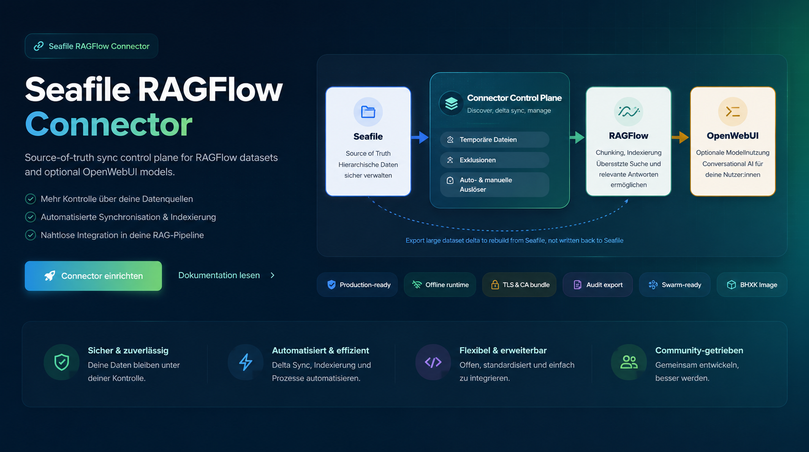
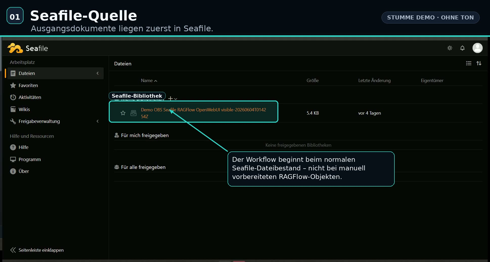
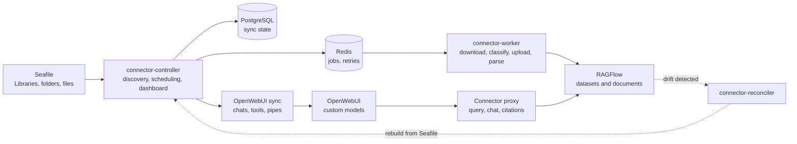

<p align="center">
  
</p>

<p align="center">
  🌐 Sprachen: <strong>Deutsch</strong> | <a href="README.en.md">English</a>
</p>

<h1 align="center">Seafile RAGFlow Connector</h1>

<p align="center">
  Synchronisiert Seafile-Bibliotheken kontrolliert nach RAGFlow und stellt sie
  bei Bedarf als OpenWebUI-Modelle bereit.
</p>

<p align="center">
  <a href="https://github.com/adrianweidig/seafile-ragflow-connector/actions/workflows/test.yml"></a>
  <a href="https://github.com/adrianweidig/seafile-ragflow-connector/actions/workflows/docker.yml"></a>
  <a href="https://github.com/adrianweidig/seafile-ragflow-connector/actions/workflows/codeql.yml"></a>
  <a href="LICENSE"></a>
  <a href="pyproject.toml"></a>
  <a href="https://github.com/adrianweidig/seafile-ragflow-connector/issues"></a>
  <a href="https://github.com/adrianweidig/seafile-ragflow-connector/pulls"></a>
</p>

## Überblick

Der Connector hält Seafile als Quelle der Wahrheit. Er entdeckt Bibliotheken,
legt passende RAGFlow-Datasets an, importiert geänderte Dateien und stößt das
Parsing an. Entfernte Dateien oder Bibliotheken werden nachvollziehbar in den
Zielsystemen bereinigt; fehlende Zielartefakte können aus Seafile wieder
aufgebaut werden.

Optional erzeugt der Connector OpenWebUI-Chats, Tools und Pipes für die
Datasets. OpenWebUI spricht dabei über den Connector-Proxy, sodass keine
RAGFlow-Admin-Secrets im Function-Code liegen.

Zusätzlich kann ein separater Search-Service als nutzernahe Wissenssuche
betrieben werden. Search-Service und OpenWebUI-Pipe bekommen keine
Seafile-Admin-Tokens; beide fragen vor RAGFlow-Abfragen die zentrale
Autorisierungs-API des Connector-Cores.

## Quick Links

| Ziel | Einstieg |
| --- | --- |
| Demo | [Demoaufnahme](#demo) |
| Schnellstart | [Docker Compose](#schnellstart-mit-docker-compose) oder [Portainer](#portainer-start) |
| Admin-Erststart | [Checkliste für den ersten produktionsnahen Start](docs/admin-first-start-checklist.md) |
| Konfiguration | [`connector.env.example`](connector.env.example), [Environment-Referenz](docs/environment.md) |
| Security und ACL | [Sicherheitsmodell](docs/security-model.md), [Access-Control](docs/access-control.md), [OpenWebUI-ACL](docs/openwebui-acl.md) |
| Wissenssuche | [Search-Service](docs/search-service.md) |
| Betrieb | [Operations-Handbuch](docs/operations.md) |
| Architektur | [Architektur](docs/architecture.md) |
| Internationalisierung | [Sprach- und Unicode-Modell](docs/i18n.md), [English docs](docs/en/index.md) |
| TLS | [TLS-Topologie](docs/tls-topology.md), [TLS-Zertifikate](docs/tls-certificates.md), [Troubleshooting](docs/troubleshooting-ssl.md) |
| Entwicklung | [Entwicklungschecks](#entwicklung) und [Tests](docs/testing.md) |
| Mitarbeit | [CONTRIBUTING.md](CONTRIBUTING.md), [Security Policy](SECURITY.md), [Support](SUPPORT.md) |

## Demo

Das Video zeigt den normalen Connector-Ablauf und bewusst kein manuelles
RAGFlow-Setup: Seafile-Bibliothek bereitstellen, Datei hochladen,
Connector-Sync starten und danach prüfen, dass RAGFlow-Dataset, RAGFlow-Chat
und OpenWebUI-Pipe automatisch entstanden sind. Am Ende wird die Antwort in
OpenWebUI über Preview und Originaldatei nachvollzogen.

Die finale stille Aufnahme liegt als MKV im Repository. Die MP4-Datei ist eine
browserfreundliche Ableitung derselben Aufnahme.

[](docs/assets/demo/seafile-ragflow-connector-demo.mkv)

[Finale MKV herunterladen](docs/assets/demo/seafile-ragflow-connector-demo.mkv)
· [MP4-Vorschau ansehen](docs/assets/demo/seafile-ragflow-connector-demo.mp4)
· [Kontaktbogen](artifacts/demo-recording-contact-sheet.jpg)
· [Aufnahme-Runbook](docs/demo-recording.md)

## Kernfunktionen

| Bereich | Was der Connector leistet |
| --- | --- |
| Source of truth | Seafile bleibt maßgeblich. Zielsystem-Drift wird repariert, nicht nach Seafile zurückgeschrieben. |
| Dataset-Lifecycle | Libraries werden entdeckt, Datasets aus `connector_template` erzeugt, Dokumente importiert und Parse-Läufe angestoßen. |
| Delta und Delete | Änderungen, entfernte Dateien und gelöschte Libraries werden nachvollziehbar in RAGFlow und optional OpenWebUI propagiert. |
| Repair statt Fragilität | Extern gelöschte RAGFlow-Datasets, Dokumente, Chats, Tools oder Pipes werden aus State und Seafile wieder aufgebaut. |
| OpenWebUI | Datasets können als Custom Models erscheinen; Tool und Pipe nutzen einen Connector-Proxy statt eingebetteter RAGFlow-Secrets. |
| ACL-aware Search | Separater Search-Service mit Trusted-Header-Auth, SearchProfiles und zentraler Authz-Prüfung vor jeder RAGFlow-Abfrage. |
| Betrieb | PostgreSQL-State, Redis-Jobs, Dashboard, Health, Metriken, Excel-Audit-Export, TLS/CA-Bundles, GHCR, Portainer, Compose und Swarm. |

## Architektur



| Komponente | Aufgabe |
| --- | --- |
| `connector-controller` | Discovery-Loop, Dataset-Provisioning, Scheduling, Dashboard |
| `connector-worker` | Download, Klassifikation, Upload, Delete, Parse-Steuerung |
| `connector-reconciler` | Reparatur abweichender Zielzustände |
| PostgreSQL | dauerhafter Sync-, Job-, Dashboard- und Mapping-State |
| Redis | Queueing, Retries und Worker-Fan-out |
| OpenWebUI Sync | optionale Erzeugung von RAGFlow-Chats, Tools und Pipes |
| Connector Proxy | geschützte OpenWebUI-Abfragen ohne RAGFlow-Secrets im Function-Code |

Mehr Details stehen in [docs/architecture.md](docs/architecture.md).

## Funktionsumfang

| Funktion | Details |
| --- | --- |
| Seafile Discovery | Library-Discovery über Admin-API, rekursive Datei-Iteration, Download-Rewrite für unterschiedliche Netzwerkpfade. |
| RAGFlow Provisioning | Dataset-Erzeugung aus `connector_template`, Erhalt live geänderter Dataset-Einstellungen, Upload und Parse-Steuerung. |
| Sync und Cleanup | Delta-Sync, Full-Sync, Delete-Propagation, orphan cleanup, Schutz vor unklaren Fremdartefakten. |
| Drift Repair | Wiederaufbau fehlender Datasets und Dokumente aus Seafile, Reparatur eigener OpenWebUI-Artefakte. |
| OpenWebUI Integration | deterministische Chats, Tools, Pipes, Custom-Model-Namen, Quellen/Citations und optionaler Preview-Viewer. |
| Dashboard und Audit | Health, Sync-Historie, Änderungen, Logs, Diagnose, TLS-Status, kontrollierte Bibliotheksauswahl und Excel-Audit-Export ohne Dateiinhaltsexfiltration. |
| Deployment | GHCR-Image, Portainer-Stack, direkte Compose-Varianten, Shared-Network-Modus, Swarm-Stack und Offline-Image-Workflow. |
| TLS und Betrieb | interne CAs, mTLS-Dateien, `.top.secret`-Lab, lokale HTTPS-Mocks und Troubleshooting für Zertifikatsketten. |
| Qualität | Ruff, mypy strict, pytest, unittest, CodeQL, Docker-Build-Workflow und Dependabot. |

## Leitplanken

- Seafile wird nie geändert, nur weil RAGFlow oder OpenWebUI driften.
- Der Connector löscht nur eigene, eindeutig zuordenbare Zielartefakte.
- RAGFlow-Dataset-Einstellungen bleiben nach der Erstellung live; das Template wird nur für neue Datasets genutzt.
- OpenWebUI-Funktionen bekommen keine RAGFlow-Admin-Secrets, sondern sprechen mit dem Connector-Proxy.
- Search-Service und OpenWebUI-Pipe bekommen keine Seafile-Admin-Tokens; RAGFlow wird nur nach zentralem `allow` abgefragt.
- Der Runtime-Betrieb ist offline-fähig: keine Telemetrie und keine externen Service-Abhängigkeiten außerhalb der konfigurierten Zielsysteme.
- Das Dashboard startet nur explizit ausgewählte Prüfläufe und kann
  connector-eigene Pipe-, Chat- oder Dataset-Artefakte löschen; Seafile-
  Bibliotheken bleiben dabei unangetastet.

## Internationalisierung

Deutsch ist die Standardsprache für CLI-Hilfen, menschenlesbare Fehlermeldungen,
Dashboard-Texte, OpenWebUI-Artefakte, README und Repository-Dokumentation.
Englisch ist die wichtigste Alternativsprache; Produktkomponenten sind zusätzlich
für `es`, `fr`, `it`, `pt`, `nl`, `pl`, `tr`, `uk`, `zh`, `ja` und `ar`
integriert. Die Sprache kann explizit über `CONNECTOR_LANGUAGE=de`,
`CONNECTOR_LANGUAGE=en` oder einen der weiteren Sprachcodes gesetzt werden; ohne
zuverlässige Vorgabe fällt der Connector stabil auf Deutsch zurück. Dashboard
und Quellenvorschau nutzen UTF-8, Browser-Locale und eine sichtbare manuelle
Sprachwahl. GitHub selbst schaltet die normale Repository-Ansicht nicht
automatisch nach Nutzersprache um, deshalb sind Sprachversionen über konkrete
Dateien und Links organisiert.

Neue Sprachen werden über Ressourcen in
[`src/seafile_ragflow_connector/locales/`](src/seafile_ragflow_connector/locales/)
ergänzt. Details stehen im [Sprach- und Unicode-Modell](docs/i18n.md).

## Voraussetzungen

- Docker mit Docker Compose Plugin oder Portainer für den regulären Betrieb.
- Ein erreichbarer Seafile-Server mit Admin-API-Token.
- Ein erreichbarer RAGFlow-Server mit API-Key.
- Ein RAGFlow-Template-Dataset wird bei Bedarf automatisch angelegt,
  standardmäßig `connector_template`.
- Optional: eine erreichbare OpenWebUI-Instanz mit Admin-API-Key.
- Für lokale Entwicklung: Python `>=3.12` und `uv`.

## Schnellstart mit Docker Compose

Für Unternehmensnetze mit HTTPS, optional eigener Root-CA und optionaler
OpenWebUI-Anbindung ist der schnellste Pfad der interaktive Compose-Assistent:

```bash
bash scripts/configure-enterprise-compose.sh
bash output/enterprise-compose/check-config.sh
bash output/enterprise-compose/up.sh
bash output/enterprise-compose/check-live.sh
```

Er erzeugt `connector.env`, wählt die passenden Compose-Dateien und bindet eine
Unternehmens-CA über `deploy/compose/enterprise-ca.compose.yml` read-only ein,
wenn der CA-Pfad bekannt ist. Ohne CA-Pfad startet der Stack mit den System-CAs;
die CA kann später über die `.env` ergänzt werden. Zusätzlich schreibt der
Assistent `output/enterprise-compose/portainer-compose.yml` und
`output/enterprise-compose/portainer.env`; diese beiden Artefakte können direkt
in Portainer eingefügt beziehungsweise als Environment importiert werden.

Der Assistent setzt für unbekannte optionale Werte robuste Defaults. Externe
Dienste werden beim Containerstart nicht hart erzwungen
(`CONNECTOR_STARTUP_CHECK=infra`), damit Dashboard und Logs auch dann
erreichbar sind, wenn RAGFlow, Seafile, ein Parser-Asset oder eine interne CA
noch korrigiert werden muss. Die echte Live-Prüfung bleibt über
`check-live.sh` explizit verfügbar.
Interne Service-Adressen, etwa `http://seafile` oder `http://ragflow:9380` in
einem gemeinsamen Docker-Netz, werden getrennt von extern erreichbaren Browser-
und OpenWebUI-Preview-URLs abgefragt.
Für die erste Administrator-Abnahme nach dem Start gibt es eine kompakte
[Admin-Erststart-Checkliste](docs/admin-first-start-checklist.md).

Die einzige Betreiberkonfiguration ist [`connector.env.example`](connector.env.example).
Kopiere sie zu `connector.env`, setze die Pflichtwerte und validiere die
Compose-Konfiguration:

```bash
cp connector.env.example connector.env

docker compose \
  --env-file connector.env \
  -f deploy/portainer/docker-compose.yml \
  config --quiet
```

Minimalpflicht für Seafile -> RAGFlow mit Stack-Postgres:

| Variable | Zweck |
| --- | --- |
| `SEAFILE_BASE_URL` | aus dem Connector-Container erreichbare Seafile-URL |
| `SEAFILE_ADMIN_TOKEN` | Seafile Admin-API-Token für Library-Discovery |
| `SEAFILE_SYNC_USER_TOKEN` | Seafile API-Token für Datei-Downloads |
| `RAGFLOW_BASE_URL` | aus dem Connector-Container erreichbare RAGFlow-API-URL |
| `RAGFLOW_API_KEY` | API-Key des RAGFlow-Zielusers |
| `POSTGRES_PASSWORD` | Passwort für die Stack-Datenbank, sofern `DATABASE_URL` nicht gesetzt ist |

Start:

```bash
docker compose \
  --env-file connector.env \
  -f deploy/portainer/docker-compose.yml \
  up -d
```

Logs und Health:

```bash
docker compose \
  --env-file connector.env \
  -f deploy/portainer/docker-compose.yml \
  logs -f connector-controller connector-worker connector-reconciler

curl http://127.0.0.1:18080/api/health
```

Das Dashboard ist bei Default-Portbindung lokal unter `http://127.0.0.1:18080`
erreichbar, wenn `CONNECTOR_DASHBOARD_ENABLED=true` gesetzt ist.

## Automatisierungen

`connector-controller` plant Discovery, Delta-Sync, RAGFlow-Template-Refresh
und optionalen OpenWebUI-Sync. `connector-reconciler` führt den
Reconciliation-Lauf aus. Alle periodischen Laufzeit-Automationen nutzen als
Standard `1800` Sekunden, also 30 Minuten, und lehnen Werte unter 60 Sekunden
ab. Der aktive Intervall wird beim Start der Prozesse geloggt.

Manuelle Prüfungen und Syncs sind unabhängig vom Zeitplan möglich:

```bash
connector check-live
connector sync-once
connector openwebui-sync-once
```

In Compose und Portainer sind die Werte über
`DISCOVERY_INTERVAL_SECONDS`, `DELTA_SYNC_INTERVAL_SECONDS`,
`RECONCILE_INTERVAL_SECONDS`, `RAGFLOW_TEMPLATE_REFRESH_SECONDS` und
`OPENWEBUI_SYNC_INTERVAL_SECONDS` konfigurierbar.

## Portainer-Start

1. In Portainer einen neuen Stack erstellen.
2. `deploy/portainer/docker-compose.yml` als Web-Editor-Inhalt einfügen oder dieses Repository als Git-Stack verwenden.
3. Den Inhalt von `connector.env.example` im Bereich `Environment variables` importieren.
4. Nur die Pflichtwerte ersetzen; OpenWebUI-Werte nur setzen, wenn die Anbindung aktiviert wird.
5. Falls Images offline bereitgestellt werden, `CONNECTOR_IMAGE`, `POSTGRES_IMAGE`, `REDIS_IMAGE` und die `*_PULL_POLICY`-Werte auf die lokal vorhandenen Images abstimmen.
6. Stack deployen und die Logs von `connector-controller`, `connector-worker` und `connector-reconciler` prüfen.

Wichtig für Portainer-Image-Uploads: Der Stack startet genau das Image, dessen
Name in `CONNECTOR_IMAGE` steht. Wenn das hochgeladene Image z. B. als
`seafile-ragflow-connector:latest` angezeigt wird, muss `CONNECTOR_IMAGE` auch
diesen Wert enthalten.
Die erste Abnahme nach dem Deploy ist in der
[Admin-Erststart-Checkliste](docs/admin-first-start-checklist.md) zusammengefasst.

## Netzwerkvarianten

Host/LAN/Reverse Proxy:

```env
CONNECTOR_DOCKER_NETWORK_EXTERNAL=false
SEAFILE_BASE_URL=http://host.docker.internal:18081
RAGFLOW_BASE_URL=http://host.docker.internal:19380
OPENWEBUI_BASE_URL=http://host.docker.internal:3000
```

Bestehendes gemeinsames Docker-Netz:

```env
CONNECTOR_DOCKER_NETWORK_EXTERNAL=true
CONNECTOR_DOCKER_NETWORK_NAME=seafile-ragflow-connector-net
SEAFILE_BASE_URL=http://seafile
RAGFLOW_BASE_URL=http://ragflow:9380
OPENWEBUI_BASE_URL=http://openwebui:8080
OPENWEBUI_PROXY_INTERNAL_BASE_URL=http://connector-controller:8080
```

`CONNECTOR_DOCKER_NETWORK_NAME` ist nur ein Default. In bestehenden Stacks muss
der Name auf das bereits vorhandene gemeinsame Docker-Netz zeigen.

## Offline-Installation

Der Online-Start kann das veröffentlichte GHCR-Image nutzen. Für
produktionsnahe Rollouts sollte nach Veröffentlichung ein fester Release-Tag
wie `2.5.3` gepinnt werden; `latest` ist eine Komfortoption für Smoke-Tests und
frische Testumgebungen.

```bash
docker pull ghcr.io/adrianweidig/seafile-ragflow-connector:2.5.3
```

Für Offline-Umgebungen können die benötigten Images vorab exportiert und auf dem
Zielhost importiert werden:

```bash
docker save \
  ghcr.io/adrianweidig/seafile-ragflow-connector:2.5.3 \
  postgres:16 \
  redis:7 \
  -o images/seafile-ragflow-portainer-images.tar

docker load -i images/seafile-ragflow-portainer-images.tar
```

Wenn interne Registry- oder lokale Image-Namen genutzt werden, trage sie in
`connector.env` ein:

```env
CONNECTOR_IMAGE=seafile-ragflow-connector:2.5.3
POSTGRES_IMAGE=postgres:16
REDIS_IMAGE=redis:7
```

## Betrieb prüfen

Nach dem Start sollten diese Punkte stimmen:

- Dashboard-Health meldet für Dashboard, Datenbank, Redis, Seafile und RAGFlow `ok`.
- In RAGFlow entsteht pro Seafile-Library ein Dataset aus dem Template.
- Dateien werden in RAGFlow hochgeladen und geparst.
- Wenn OpenWebUI aktiviert ist, erscheinen pro Dataset ein Tool und eine Pipe beziehungsweise ein auswählbares Custom Model.
- Wird eine Seafile-Library gelöscht, entfernt der Connector die zugehörigen eigenen RAGFlow- und OpenWebUI-Artefakte.

Die Compose-Datei referenziert keine lokale `env_file`. Docker Compose bekommt
die Werte über `--env-file connector.env`; Portainer bekommt dieselben Werte
über den Environment-Variablen-Import.

## Dashboard

Der Connector enthält ein HTTP-Dashboard für Administratoren, Auditoren und
Entwickler. Es zeigt Connector-Zustand, Sync-Historie, Änderungen,
Quellen/Ziele, gefilterte Logs und technische Diagnosewerte. Im laufenden
`connector-controller` kann der Tab **Prüfablauf** die mit dem aktuellen
Seafile-API-Key sichtbaren Bibliotheken anzeigen und ausgewählte Bibliotheken
für RAGFlow-Dataset-/Dokument-Sync sowie OpenWebUI-Chat-/Tool-/Pipe-Sync
starten. Es unterstützt einfache HTTP-Basic-Authentifizierung per Environment.
Wer die Oberfläche nicht erreichbar machen will, aktiviert sie nicht oder
veröffentlicht den Port nicht.

Die Oberfläche nutzt keine CDN- oder Internet-Assets, bietet einen Dark-/Light-
Modus und enthält Auto-Refresh für 5 Sekunden, 10 Sekunden oder 1 Minute. Der
Excel-Audit-Export enthält mehrere Tabellenblätter und exportiert nur Status-,
Sync-, Änderungs-, Log- und Diagnosemetadaten. Datei-Inhalte aus Seafile oder
RAGFlow werden nicht heruntergeladen. Im OpenWebUI-Tab können connector-eigene
Pipes, RAGFlow-Chats und RAGFlow-Datasets gezielt gelöscht werden; Seafile-
Bibliotheken und Dateien werden dabei nicht gelöscht.

```env
CONNECTOR_DASHBOARD_ENABLED=true
CONNECTOR_DASHBOARD_HOST=0.0.0.0
CONNECTOR_DASHBOARD_PORT=8080
CONNECTOR_DASHBOARD_PUBLISHED_PORT=127.0.0.1:18080
CONNECTOR_DASHBOARD_AUTH_USERNAME=admin
CONNECTOR_DASHBOARD_AUTH_PASSWORD=change-me-dashboard-password
```

## Optionale OpenWebUI-Anbindung

Die OpenWebUI-Anbindung ist standardmäßig vollständig deaktiviert. Wenn sie per
Environment aktiviert wird, synchronisiert der Connector pro RAGFlow-Dataset
einen RAGFlow-Chat-Assistant sowie je ein OpenWebUI-Tool und eine Pipe. Die
Pipe erscheint in OpenWebUI als auswählbares Custom-Model. Tool und Pipe
enthalten keine RAGFlow- oder Admin-Secrets, sondern rufen den geschützten
Connector-Proxy auf.
Der Sync legt zusätzlich den Template-Chat `connector_template_chat` an, falls
er fehlt, und hält eigene Dataset-Chats auf RAG-Defaults mit Zitaten,
Multiturn-Kontext und Referenz-Metadaten.

```env
OPENWEBUI_INTEGRATION_ENABLED=true
OPENWEBUI_BASE_URL=http://openwebui:8080
OPENWEBUI_ADMIN_API_KEY=change-me
OPENWEBUI_SYNC_MODE=sync
OPENWEBUI_PROXY_INTERNAL_BASE_URL=http://connector-controller:8080
OPENWEBUI_PROXY_PUBLIC_BASE_URL=http://localhost:18080
OPENWEBUI_PROXY_SHARED_SECRET=change-me
OPENWEBUI_PIPE_ANSWER_SYNTHESIS_ENABLED=false
```

`OPENWEBUI_SYNC_MODE` unterstützt `disabled`, `dry-run`, `sync` und `repair`.
Für `sync` und `repair` sind `OPENWEBUI_ADMIN_API_KEY`,
`OPENWEBUI_PROXY_SHARED_SECRET` und eine Proxy-Base-URL erforderlich, wenn Tools
oder Pipes erzeugt werden. Für eine reine Vorprüfung kann `dry-run` gesetzt
werden. Quellen werden standardmäßig im Auditmodus als deutsche
Markdown-Nachweistabelle mit konsistenten Quellenmarken wie `[S1]`,
Claim-Abdeckung, Rollen, Match-Typ, Audit-Score, Fundstelle und Direktlink
angezeigt. Für eine kompaktere OpenWebUI-Darstellung kann
`SOURCE_DISPLAY_MODE=compact` native Citation-Events nutzen. Für stabile
Sprunglinks zur Fundstelle ist `OPENWEBUI_SOURCE_PREVIEW_MODE=connector_viewer`
empfohlen; die Pipe erscheint im Modellpicker als `Seafile · <Dataset>`.
Falls der RAGFlow-Chat in einer Umgebung nur Retrieval-Treffer zurückliefert,
kann die Pipe optional einen OpenAI-kompatiblen Fallback wie LiteLLM nutzen:
`OPENWEBUI_PIPE_ANSWER_SYNTHESIS_ENABLED=true`,
`OPENWEBUI_PIPE_ANSWER_LLM_BASE_URL`, `OPENWEBUI_PIPE_ANSWER_LLM_MODEL` und
`OPENWEBUI_PIPE_ANSWER_LLM_API_KEY` werden dann als Runtime-Werte in die Pipe
synchronisiert.

## TLS und interne CAs

Wenn eine Umgebung interne oder selbstsignierte Zertifikate nutzt und der
Connector `unable to get local issuer certificate` meldet, lege die
Root-/Intermediate-CA als PEM-Datei auf dem Docker-Host ab und setze z. B.:

```env
CONNECTOR_ENTERPRISE_CA_HOST_FILE=/opt/seafile-ragflow-connector/certs/company-root-ca.pem
CONNECTOR_ENTERPRISE_CA_CONTAINER_FILE=/certs/company-root-ca.pem
CONNECTOR_CA_BUNDLE=/certs/company-root-ca.pem
SEAFILE_VERIFY_SSL=true
RAGFLOW_VERIFY_SSL=true
OPENWEBUI_VERIFY_SSL=true
```

`CONNECTOR_CA_BUNDLE` gilt für Seafile, RAGFlow und OpenWebUI. Falls nur ein
Dienst betroffen ist, kann stattdessen `SEAFILE_CA_BUNDLE`,
`RAGFLOW_CA_BUNDLE` oder `OPENWEBUI_CA_BUNDLE` gesetzt werden.
`*_VERIFY_SSL=false` ist nur als kurzfristige Diagnose gedacht.

Für Compose-Installationen setzt das Overlay
[`deploy/compose/enterprise-ca.compose.yml`](deploy/compose/enterprise-ca.compose.yml)
dies konsistent für Controller, Worker und Reconciler. Das Overlay wird nur
benötigt, wenn eine eigene CA eingebunden werden muss; ohne CA nutzt der
Container den aktualisierten System-Trust-Store. Der Assistent
[`scripts/configure-enterprise-compose.sh`](scripts/configure-enterprise-compose.sh)
erzeugt daraus direkt eine lauffähige Enterprise-Konfiguration.

Beim Start prüft der Connector für Seafile, RAGFlow und, falls aktiviert,
OpenWebUI zuerst dieselbe Host-/Port-Basis über `https://`. Nur wenn darüber
kein HTTP-Response zustande kommt, fällt er auf `http://` zurück. Der
Dashboard-Health-Bereich zeigt je Komponente, ob aktuell HTTPS oder HTTP
genutzt wird und ob ein Fallback nach einem HTTPS-Fehler aktiv ist.

Für lokale Root-CA-, Leaf-Zertifikat-, Hostname- und Ablaufdatumstests gibt es
ein HTTPS-Lab unter [deploy/tls-lab](deploy/tls-lab/README.md) sowie den lokalen
Compose-Betrieb mit [`connector.top.secret`](docs/local-https-compose.md).

## CLI

Das Paket stellt den Befehl `connector` bereit. Wichtige Kommandos:

| Kommando | Zweck |
| --- | --- |
| `connector init-db` | Connector-State-Tabellen anlegen oder migrieren |
| `connector check-live` | Datenbank, Redis, Seafile und RAGFlow ohne Mutation prüfen |
| `connector sync-once` | einen vollständigen Discovery- und Sync-Lauf ausführen |
| `connector cleanup-orphans` | verwaiste connector-eigene Zielartefakte planen oder löschen |
| `connector openwebui-sync-once` | einen OpenWebUI-Sync-Lauf ausführen |
| `connector demo-fixtures` | lokale Demo-Dateien erzeugen |
| `connector demo-bootstrap` | Demo-Libraries vorbereiten und optional synchronisieren |
| `connector demo-cleanup` | klar benannte lokale Demo-Artefakte planen oder löschen |
| `connector dashboard` | lesendes Dashboard starten |
| `connector controller`, `worker`, `reconciler` | Runtime-Prozesse starten |

Die produktive Nutzung erfolgt normalerweise über die Compose-/Portainer-
Services statt über manuelle CLI-Prozesse.

## Repository-Struktur

| Pfad | Zweck |
| --- | --- |
| `.github/` | GitHub Actions, Issue-/PR-Vorlagen und Dependabot |
| `deploy/docker/` | Dockerfile und Container-Entrypoint für das Connector-Image |
| `deploy/portainer/` | Portainer-fähige Compose-Datei für die zentrale `connector.env.example` |
| `deploy/compose/` | Direkt nutzbare Compose-Varianten für Host/LAN, Shared Network, OpenWebUI und lokale HTTPS-Mocks |
| `deploy/swarm/` | Docker-Swarm-Alternative mit Stackfile und Env-Vorlage |
| `docs/` | Architektur, Konfiguration, Betrieb, TLS, FAQ und Maintainer-Hinweise |
| `migrations/` | Alembic-Migrationen für PostgreSQL/SQLite-Testdatenbanken |
| `src/seafile_ragflow_connector/` | Anwendungscode für CLI, Sync, Clients, Dashboard, Jobs und OpenWebUI |
| `tests/` | Unit-, Integrations- und Support-Tests mit lokalen Fakes/Fixtures |

## Entwicklung

```bash
uv sync --locked --all-extras
python -m compileall src tests migrations scripts
PYTHONPATH=src python -m unittest discover -s tests/unit
```

Vollständige Entwicklungsumgebungen können zusätzlich ausführen:

```bash
uv sync --all-extras
uv run ruff check .
uv run mypy src
uv run pytest
```

Für wiederholbare lokale Prüfungen gibt es einen zentralen Verify-Runner:

```bash
python scripts/verify.py --skip-compose
```

Wenn Docker Compose auf dem Host verfügbar ist, prüft der Runner zusätzlich die
Portainer-Compose-Konfiguration. Erzwingen lässt sich diese Prüfung mit:

```bash
python scripts/verify.py --with-compose
```

Unter Windows mit Docker in WSL sollte der WSL-Wrapper genutzt werden. Er legt
die `uv`-Umgebung außerhalb des Windows-Checkouts an und vermeidet Konflikte
mit einer vorhandenen Windows-`.venv`:

```bash
wsl -d Debian -- bash -lc 'cd /mnt/e/Codex_Workspace/repos/seafile-ragflow-connector && bash scripts/verify_wsl.sh --with-compose --with-dashboard-browser-smoke'
```

## Dokumentation

- [Dokumentationsindex](docs/README.md)
- [Deutscher Dokumentationseinstieg](docs/de/index.md)
- [English documentation entry](docs/en/index.md)
- [Admin-Erststart-Checkliste](docs/admin-first-start-checklist.md)
- [Internationalisierung und Unicode](docs/i18n.md)
- [Architektur](docs/architecture.md)
- [Konfiguration](docs/configuration.md)
- [Environment-Variablen](docs/environment.md)
- [Manueller Seafile-RAGFlow-OpenWebUI-Prüfablauf](docs/manual-workflow-verification.md)
- [Test- und Ausführungsmodell](docs/testing.md)
- [Betrieb, Offline-Deployment und WSL-/Docker-Prüfung](docs/operations.md)
- [Lokaler HTTPS-Compose-Betrieb mit connector.top.secret](docs/local-https-compose.md)
- [RAGFlow-Template-Verhalten](docs/ragflow-template.md)
- [TLS-Zertifikate](docs/tls-certificates.md)
- [TLS-Topologie](docs/tls-topology.md)
- [Docker-Compose mit TLS](docs/docker-compose-tls.md)
- [SSL-/TLS-Troubleshooting](docs/troubleshooting-ssl.md)
- [FAQ](docs/FAQ.md)
- [Release-Prozess](docs/RELEASE_PROCESS.md)
- [Maintainer-Checkliste](docs/MAINTAINER_CHECKLIST.md)

## Mitarbeit und Support

Beiträge sind willkommen, solange sie den konservativen Sync-Kern respektieren:
Seafile bleibt Quelle der Wahrheit, Zielsysteme werden daraus aufgebaut, Secrets
bleiben außerhalb des Repositories und produktive Systeme werden nicht ohne
ausdrücklichen Auftrag mutiert.

- Mitarbeit: [CONTRIBUTING.md](CONTRIBUTING.md)
- Support-Fragen: [SUPPORT.md](SUPPORT.md)
- Sicherheitsmeldungen: [SECURITY.md](SECURITY.md)
- Verhaltensregeln: [CODE_OF_CONDUCT.md](CODE_OF_CONDUCT.md)
- Änderungen: [CHANGELOG.md](CHANGELOG.md)

## Roadmap

Es gibt derzeit keine verbindliche öffentliche Roadmap. Neue Themen sollten als
Issues erfasst und gegen die vorhandenen Betriebsziele geprüft werden:
offline-fähiger Betrieb, Portainer-taugliche Deployment-Artefakte,
konservative Delete-/Repair-Logik, TLS-fähige interne Umgebungen und optionale
OpenWebUI-Anbindung.

## Lizenz

Dieses Projekt steht unter der [MIT-Lizenz](LICENSE). Bei kommerziell oder
rechtlich kritischer Nutzung sollte die Lizenzentscheidung menschlich geprüft
werden.

## Hinweise für Codex und andere Agenten

Projektbezogene Arbeitsregeln stehen in [AGENTS.md](AGENTS.md). Wichtig sind
vor allem: vor Änderungen den Git-Zustand prüfen, bestehende Änderungen
bewahren, keine Secrets ausgeben oder persistieren, keine produktiven Dienste
ohne Auftrag mutieren und Löschungen nur nach Referenzprüfung durchführen.

Wenn dieses Repository hilfreich ist, sind präzise Issues, reproduzierbare
Fehlerberichte und kleine Pull Requests die beste Unterstützung.
